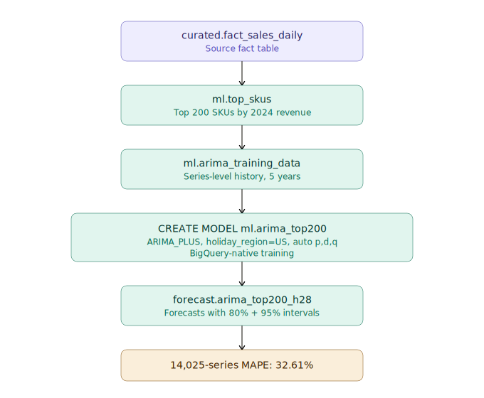
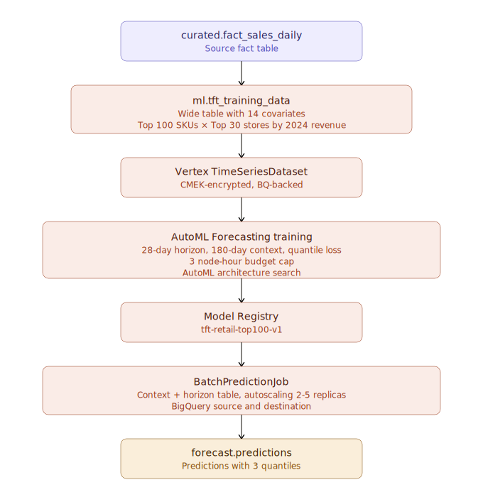

# Architecture

This document is the deep walkthrough of the GCP retail forecasting pipeline — design decisions, data model, security baseline, model training internals, evaluation methodology, and operational characteristics. For the headline result and quick comparison tables, see [`README.md`](README.md). For interview-style design Q&A, see [`QA.md`](QA.md).

---

## Architectural overview

The pipeline has three logical phases: data generation and curation, two parallel ML training branches, and a unified evaluation harness that compares both models on identical holdout data.


---

## Security baseline

Production GCP work starts with security. This pipeline implements the minimum production-grade baseline:

### Cloud KMS

A regional keyring `retail-keyring` in `us-central1` with four customer-managed encryption keys, all with 90-day automatic rotation:

- `key-bigquery` — encrypts all 5 BigQuery datasets
- `key-storage` — encrypts all 5 GCS buckets
- `key-vertex` — encrypts Vertex AI training pipelines and registered models
- `key-dataflow` — encrypts Dataflow staging (reserved for future)

Every storage layer in the pipeline uses CMEK, not Google-managed keys. Vertex AI service agents are granted `roles/cloudkms.cryptoKeyEncrypterDecrypter` on `key-vertex` so the platform can encrypt training artifacts.

### Service accounts (least privilege)

Five dedicated service accounts, each scoped to its role:

| SA | IAM | Purpose |
|----|-----|---------|
| `sa-data-loader` | `bigquery.dataEditor`, `storage.objectAdmin` (raw) | Loads Parquet → BigQuery |
| `sa-bqml-trainer` | `bigquery.dataEditor` (ml, forecast) | Runs BQML CREATE MODEL |
| `sa-vertex-trainer` | `aiplatform.user`, `bigquery.dataViewer`, `storage.objectAdmin` | Submits Vertex training |
| `sa-dataflow-runner` | `dataflow.worker`, `bigquery.dataEditor` | Reserved for streaming work |
| `sa-composer` | `composer.worker`, `aiplatform.user` | Reserved for orchestration |

No shared accounts. No project-level admin grants. Each pipeline stage uses the SA with the minimum permissions to do its job.

### Network and access

- All GCS buckets: uniform bucket-level access, public access prevention enabled
- BigQuery datasets: project-level access only, no public sharing
- VPC and Private Google Access: configured at project level (default)

This baseline is the floor, not the ceiling. A production deployment in a regulated environment would add VPC Service Controls, organization policies, and audit log routing — all of which are additive to what's already here.

---

## Data layer

### Synthetic data generation

A multiplicative demand model produces realistic retail transactions:

```
demand = floor(
  base × store_traffic × seasonal × DOW × holiday × promo × weather × ε × lifecycle_mask
)
```

Each component is calibrated to be realistic:

**`base`** — SKU-level baseline daily demand, drawn from a heavy-tailed distribution per category. Beverages average 8-12 units/day; Electronics average 1-3; Apparel 2-5.

**`store_traffic`** — Multiplier per store. Flagship stores 1.4-2.0×, satellite 0.6-0.9×.

**`seasonal`** — Category-specific sinusoidal patterns. Cold beverages peak July, trough January (amplitude 0.5). Hot beverages inverse. Apparel double-peak (spring+fall). Electronics has a Black Friday spike modeled as a holiday boost.

**`DOW` (day of week)** — Standard retail weekend lift: Friday 1.2, Saturday 1.4, Sunday 1.5, Monday 0.85.

**`holiday`** — Per-category holiday coefficients. Some categories drop on holidays (Home_Goods on Christmas Day), others spike (Beverages on July 4).

**`promo`** — 12% probability per SKU per week. Lift 1.5-2.5× depending on category elasticity.

**`weather_temp_f`** — Daily temperature drawn from regional baseline + seasonal + noise. Each SKU has a category-specific weather coefficient: Beverages_Cold positive, Beverages_Hot negative.

**`ε` (noise)** — Poisson noise centered on the deterministic mean.

**`lifecycle_mask`** — 80% of SKUs sell across the full 7 years; 10% are "launches" (entering 2022-2023); 10% are "discontinues" (exiting 2024). This generates realistic data sparsity for the lifecycle attribute.

The generator runs in pure Python, writes Parquet to `data/sales/year=YYYY/sales.parquet` with Snappy compression. ~507 MB total. ~118.6M rows.

### Curated layer

`curated.fact_sales_daily` is the heart of the pipeline. Single denormalized fact table:

```sql
CREATE TABLE curated.fact_sales_daily (
  -- Keys
  sale_date DATE,
  store_id STRING,
  sku_id STRING,
  
  -- Target
  units_sold INT64,
  net_revenue NUMERIC,
  gross_revenue NUMERIC,
  
  -- Store dimensions (denormalized)
  region STRING,
  metro STRING,
  store_format STRING,
  
  -- SKU dimensions (denormalized)
  category STRING,
  subcategory STRING,
  brand STRING,
  regular_price NUMERIC,
  lifecycle STRING,
  
  -- Per-day operational
  price NUMERIC,           -- actual selling price (may differ from regular)
  promo_flag INT64,        -- 0 / 1
  weather_temp_f FLOAT64,
  
  -- Calendar features
  sale_year INT64,
  sale_month INT64,
  day_of_week STRING,
  is_weekend BOOL,
  is_holiday BOOL,
)
PARTITION BY sale_date
CLUSTER BY (store_id, sku_id)
```

Partitioning by `sale_date` is the right choice for forecasting workloads — every training query and every evaluation query has a date-range predicate. Clustering by (store_id, sku_id) accelerates per-series joins, which dominate the evaluation queries.

33.7 GB total. Storage cost negligible.

**Why denormalize?** Both BQML and Vertex AI Forecast prefer wide tables. Joining at query time is possible but adds latency at every evaluation pass. Denormalize once, query many times.

---

## ARIMA pipeline

The ARIMA branch is the "fast and cheap" path. End-to-end in under 5 minutes for ~$2.



### Series selection

```sql
-- ml.top_skus: top 200 SKUs by 2024 revenue
SELECT sku_id, SUM(net_revenue) AS revenue_2024
FROM curated.fact_sales_daily
WHERE sale_year = 2024
GROUP BY sku_id
ORDER BY revenue_2024 DESC
LIMIT 200;
```

200 SKUs × 75 stores = 15,000 series. Revenue range: $7.6M – $330M per SKU.

### Training data shape

```sql
CREATE TABLE ml.arima_training_data (
  series_key STRING,    -- CONCAT(store_id, '-', sku_id)
  store_id STRING,
  sku_id STRING,
  sale_date DATE,
  units_sold INT64
)
```

5 years of history (2020-01-01 → 2024-12-31). 24.7M rows. The narrow shape is intentional — ARIMA_PLUS is univariate, it only consumes the time series and the timestamp.

### Model creation

```sql
CREATE OR REPLACE MODEL ml.arima_top200
OPTIONS (
  model_type='ARIMA_PLUS',
  time_series_data_col='units_sold',
  time_series_timestamp_col='sale_date',
  time_series_id_col='series_key',
  auto_arima=true,
  data_frequency='DAILY',
  holiday_region='US'
);
```

Compile time: ~3 minutes for 15,000 series. Cost: ~$2.

BQML automatically:
- Detects holidays (US calendar)
- Detects drift in each series
- Selects optimal (p, d, q) order per series via AIC
- Handles missing dates by interpolation

### Evaluation

`ML.EVALUATE` returns AIC and other in-sample metrics. ~8.5% of series have detected drift; mean AIC is 7902. These tell us BQML found reasonable fits, not whether the model will predict well — that comes from the holdout MAPE.

### Forecast

```sql
CREATE TABLE forecast.arima_top200_h28
PARTITION BY DATE(forecast_timestamp)
CLUSTER BY store_id, sku_id
AS
SELECT *
FROM ML.FORECAST(
  MODEL ml.arima_top200,
  STRUCT(28 AS horizon, 0.95 AS confidence_level)
);
```

420K predictions (15,000 × 28 days). Includes point estimate, 80% and 95% prediction intervals.

**Quirk found in the build:** `ML.FORECAST` returns implicitly ordered rows. CREATE TABLE AS SELECT against this generates a clustering issue. Workaround: insert into a partitioned destination via two-step pattern (intermediate unsorted table, then INSERT INTO target).

### Evaluation result

OVERALL weighted MAPE on Jan 1-28 2025: **32.61%**. Best category: Beverages_Hot 21.6%. Worst: Beverages_Cold 40.4% (low denominator in winter, MAPE pathology).

---

## TFT pipeline

The TFT branch is the deep-learning challenger. End-to-end in ~5 hours for ~$20-30, but recovers covariate signal ARIMA cannot see.



### Series selection (different from ARIMA)

```sql
-- Top 30 stores by 2024 revenue × top 100 SKUs by 2024 revenue = 3,000 series
```

Smaller training set than ARIMA because:
- Vertex AI AutoML scales worse with series count
- 3-node-hour budget cap (~$64) limits compute
- Top-100 SKUs by revenue is dominated by Apparel, Electronics, Home_Goods; smaller, lower-revenue categories like Beverages drop out

### Training data shape (different from ARIMA)

`ml.tft_training_data` is wide:

```sql
CREATE TABLE ml.tft_training_data (
  -- Identifier (NOT in column_specs — special metadata)
  series_id STRING,         -- CONCAT(store_id, '_', sku_id)
  
  -- Time
  sale_date DATE,
  
  -- Target
  units_sold FLOAT64,
  
  -- Available-at-forecast covariates (we'll know future values at predict time)
  promo_flag INT64,
  price FLOAT64,
  weather_temp_f FLOAT64,
  is_holiday INT64,
  is_weekend INT64,
  day_of_week STRING,
  sale_month INT64,
  
  -- Static per-series attributes
  store_id STRING,
  sku_id STRING,
  region STRING,
  category STRING,
  brand STRING,
  store_format STRING,
  regular_price FLOAT64,
  lifecycle STRING
)
PARTITION BY sale_date
CLUSTER BY store_id, sku_id
```

4.86M rows (3,000 series × 1,826 days). 5 years of history.

### Vertex AI Forecast training submission

The training submission via Python SDK has several non-obvious requirements I had to discover empirically:

```python
# Correct configuration after multiple iteration cycles
job = aiplatform.AutoMLForecastingTrainingJob(
    display_name="tft-retail-train-v1",
    optimization_objective="minimize-quantile-loss",  # required for quantile output
    column_specs={
        "sale_date":      "timestamp",
        "units_sold":     "numeric",
        "promo_flag":     "categorical",
        "price":          "numeric",
        # ... 17 more columns
        # series_id is NOT here — identifier columns are metadata, not features
    },
    training_encryption_spec_key_name=KMS_KEY_VERTEX_PATH,  # split from
    model_encryption_spec_key_name=KMS_KEY_VERTEX_PATH,      # plain encryption_spec
)

model = job.run(
    dataset=dataset,
    target_column="units_sold",
    time_column="sale_date",
    time_series_identifier_column="series_id",   # standalone, not in column_specs
    
    available_at_forecast_columns=[
        "sale_date",                              # time column MUST be listed here
        "promo_flag", "price", "weather_temp_f",
        "is_holiday", "is_weekend", "day_of_week", "sale_month",
    ],
    
    unavailable_at_forecast_columns=["units_sold"],  # target MUST be listed here
    
    time_series_attribute_columns=[
        # Static attributes — NO series_id (it's the identifier, not an attribute)
        "store_id", "sku_id", "region", "category", "brand",
        "store_format", "regular_price", "lifecycle",
    ],
    
    forecast_horizon=28,
    context_window=180,
    data_granularity_unit="day",
    quantiles=[0.1, 0.5, 0.9],
    budget_milli_node_hours=3000,
    sync=True,
)
```

The configuration constraints:
- `series_id` (the identifier column) must NOT appear in `column_specs` or any role list — Vertex treats it as metadata
- The target column must be in `unavailable_at_forecast_columns` (despite the name, this is where the past-only target lives)
- The time column must be in `available_at_forecast_columns`
- `quantiles` requires `optimization_objective="minimize-quantile-loss"` — quantile + RMSE is rejected
- Encryption was split into separate parameters for training pipeline vs registered model
- AutoML Forecast does not accept user-specified service accounts — it uses Google's managed service identity

These are not in the public docs cleanly. Each one was discovered through error messages.

### Training duration and cost

Wall-clock: 4 hours 18 minutes. Budget consumed: bounded by 3-node-hour cap (~$64 ceiling); actual ~$15-25.

Training stages (observed via Cloud Logging):
1. Data ingest from BigQuery (~5 min)
2. Feature processing and validation (~5 min)
3. Architecture search across multiple TFT configurations (~3-3.5 hours)
4. Final training on winning config (~15-20 min)
5. Model export and registration (~2-3 min)

The architecture search was the long phase. AutoML evaluates many TFT variants in parallel and picks the best by validation quantile loss.

### Batch prediction

```python
batch_job = model.batch_predict(
    job_display_name=f"tft-batch-predict-{timestamp}",
    bigquery_source="bq://gcp-retail-prediction.ml.tft_prediction_request",
    bigquery_destination_prefix="bq://gcp-retail-prediction.forecast",
    machine_type="n1-standard-4",
    starting_replica_count=2,
    max_replica_count=5,
    encryption_spec_key_name=KMS_KEY_VERTEX_PATH,
    sync=True,
)
```

The prediction request table contains both context (180 days of history per series) AND the future horizon (28 days with covariates filled in but `units_sold` NULL). Vertex's batch inference reads context, predicts horizon, writes back as STRUCT.

Output schema:
```
predicted_units_sold STRUCT<
  value FLOAT64 (point estimate),
  quantile_predictions ARRAY<FLOAT64>,  -- [P10, P50, P90]
  quantile_values ARRAY<FLOAT64>        -- [0.1, 0.5, 0.9]
>
```

Wall-clock: 30 min 23 sec. Cost: ~$3-5. 78,960 predictions, zero failures.

**Output schema quirk:** Vertex returns `sale_date` and prediction values as STRING. Cast to DATE and FLOAT64 at the join boundary in evaluation queries.

---

## Evaluation methodology

### Holdout window

January 1-28, 2025. 28 days, never seen during training. Same window for both models.

### Filter discipline

The two models trained on different SKU subsets (top 200 vs top 100). For the comparison, we restrict ARIMA's predictions via:

```sql
WHERE EXISTS (
  SELECT 1 FROM tft_predictions t
  WHERE t.store_id = p.store_id AND t.sku_id = p.sku_id
)
```

This ensures we only compare on the 2,820 series TFT covered. Apples-to-apples.

### Metric: weighted MAPE

```sql
ROUND(100 * SUM(ABS(predicted - actual)) / SUM(actual), 2) AS weighted_mape_pct
```

We use weighted MAPE (sum of absolute errors / sum of actuals) rather than per-series-then-averaged MAPE because the latter explodes on small-volume series in winter. Weighted MAPE is the metric Walmart, Amazon, and Kaggle's M5 competition use — it's robust to the small-denominator pathology.

### Filter: actuals > 0

`WHERE units_sold > 0` because MAPE is undefined when actual = 0. Standard practice.

---

## What worked, what didn't

### What worked
- **CMEK enforcement from day 0.** Setting up customer-managed encryption before any data is loaded means there's never a window where data is on Google-managed keys.
- **PowerShell + bq + Python SDK approach.** No Terraform meant fast iteration, and the project remained deployable on a fresh Windows machine in under an hour.
- **Idempotent SQL.** Every BQML script is `CREATE OR REPLACE TABLE`. Re-running is safe.
- **Vertex AI dataset reuse logic.** Once I added the `find-or-create` pattern (look up dataset by display name, reuse if exists), iterating on the training submission stopped accumulating orphan datasets.

### What was painful
- **Vertex AI SDK API instability.** Five sequential schema validation errors during training submission, each requiring trial-and-error to resolve. Each error message pointed at a different constraint that wasn't in the docs.
- **Console rebrand.** GCP renamed Vertex AI to "Agent Platform" mid-2026. The Python SDK still prints old `vertex-ai/...` URLs which 404. Substitute `agent-platform/...` to navigate.
- **AutoML training duration.** Documentation said 60-90 minutes; actual was 4h 18m. The 3-node-hour cost cap held, but planning around the wall-clock requires a wider window.
- **Empty SDK error reporting.** The first training submission failed silently in `sync=False` mode — the SDK printed success but the API never accepted the job. Switching to `sync=True` surfaced the actual errors.

### What I'd do differently
- Pin SDK versions in `requirements.txt`. The lab worked with `google-cloud-aiplatform >= 1.78`, but the API has churned since.
- Build the prediction request table earlier. Doing it during the wait-for-training period would have saved sequential time.
- Set up Cloud Build for the Python pieces. Manual `python script.py` works for one developer; not for a team.

---

## Operational characteristics

### Cost predictability
The Vertex AI training is the only step with unpredictable wall-clock. Cost is bounded by the 3-node-hour budget cap (~$64 hard ceiling). All other steps are linear in row count — predictable.

### Failure modes
- **AutoML training timeout**: caps at budget. Returns whatever model it had.
- **AutoML training cancellation**: can be triggered via console. Returns no model.
- **Batch prediction partial failure**: some series may fail (e.g., insufficient context). Vertex reports `successfulCount` separately from `failedCount`.
- **CMEK key disabled**: would block all reads/writes to encrypted resources. Requires key re-enable.

### Monitoring
The pipeline is designed for periodic batch execution, not streaming. Monitoring would consist of:
- Cloud Logging for pipeline submission/completion
- BigQuery metadata queries for table freshness
- Vertex AI Model Monitoring for prediction drift (not implemented in this version)
- A daily MAPE evaluation query against the rolling 28-day holdout

For production deployment, see the "Future work" section.

---

## Future work

This pipeline is the foundation. Production deployment would extend it with:

1. **Composer (Airflow) DAG** to orchestrate weekly retraining and daily forecast runs. Cost: ~$300-400/month for the Composer environment, dominant cost driver if added.
2. **Model Monitoring** for prediction drift, feature drift, and skew detection. Vertex AI offers this natively.
3. **Per-category top-N selection** instead of global top-N to ensure fair coverage. Currently top-100 squeezes out Beverages.
4. **Hierarchical forecasting** to reconcile predictions at the (region, category) and (store, category) levels with the per-(store, SKU) base predictions.
5. **Online inference endpoint** for low-latency lookups against the trained TFT model.
6. **CI/CD via Cloud Build** for the Python pieces, with secrets pulled from Secret Manager.
7. **VPC Service Controls** for compliance environments.

These extensions are additive. The current architecture supports them all without redesign.

---

## File and resource inventory

### Storage
- 5 GCS buckets with CMEK and uniform access
- 5 BigQuery datasets with CMEK
- 1 KMS keyring with 4 keys, 90-day rotation

### Compute
- BQML training jobs (transient)
- Vertex AI training pipelines (transient, on n1-standard-8 fleet)
- Vertex AI batch prediction jobs (transient, on n1-standard-4 fleet, autoscaling 2-5 replicas)

### Identity
- 5 service accounts on least-privilege bindings

### Source code
- 9 SQL files (all idempotent CREATE OR REPLACE)
- 2 Python files (training + batch prediction)
- 1 PowerShell config file
- 1 Python data generator with 2 modules

Total LOC: roughly 1,200 across SQL + Python.

---

For headline results and quick comparison tables, see [`README.md`](README.md). For interview-style design and engineering Q&A, see [`QA.md`](QA.md).
