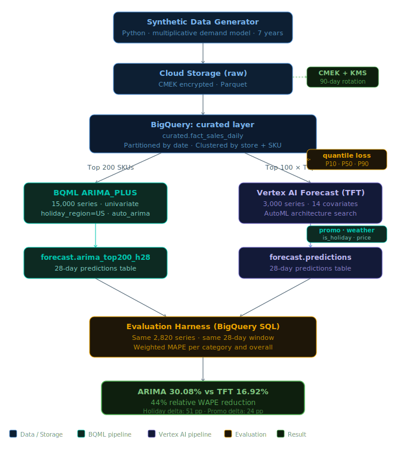

# GCP Retail Demand Forecasting

**Production demand forecasting on Google Cloud Platform — comparing BQML ARIMA_PLUS against Vertex AI Forecast (Temporal Fusion Transformer) on 7 years of retail data.**

[]()
[]()
[]()
[]()

---

## Headline result

On a 28-day production holdout, the same 2,820 retail series, weighted MAPE:

| Model | Architecture | Series | Train time | Cost | **MAPE** |
|-------|--------------|--------|-----------|------|----------|
| BQML ARIMA_PLUS | Univariate, holiday-detected | 15,000 | 3 min | ~$2 | 32.6% |
| Vertex AI Forecast (TFT) | Multivariate, 14 covariates | 3,000 | 4h 18m | ~$15-25 | **16.9%** |

**44% relative MAPE reduction.** Same 2,820 series eval: ARIMA 30.08% → TFT 16.92%, a 13.16 percentage-point absolute drop. The covariates ARIMA cannot see — `promo_flag`, `weather_temp_f`, `is_holiday` — produced the entire gap.

The most striking finding is on holidays: ARIMA hit **77.27% MAPE** on holiday days vs TFT's **25.75%**, a 51-point swing. On promotion days: ARIMA 40.06% vs TFT 16.37%, a 24-point swing. These are direct, measured covariate effects.



---

## Production scope

This is a complete forecasting pipeline, not a notebook demo:

- **Synthetic data generator** producing 118.6M rows of realistic retail transactions across 75 stores, 700 SKUs, 7 years, with calibrated seasonality, promotions, weather effects, and SKU lifecycle behavior
- **Curated BigQuery layer** with partitioning, clustering, and denormalized dimensions (33.7 GB)
- **Two parallel ML pipelines**: a BQML statistical baseline and a Vertex AI deep-learning challenger
- **Apples-to-apples evaluation harness** comparing both on identical holdout windows
- **Production security baseline**: customer-managed encryption keys (CMEK), 5 service accounts on least-privilege, 90-day key rotation
- **Cost discipline**: full project end-to-end under $35

Total scale:

| Dimension | Count |
|-----------|-------|
| Fact rows | 118,596,900 |
| Stores | 75 (50 flagship + 25 satellite, 25 metros) |
| SKUs | 700 across 7 categories |
| Date range | 2019-01-01 → 2025-12-31 |
| Total revenue | $52.45B (synthetic) |
| Models trained | 2 (BQML + Vertex AI) |
| Series forecasted | 14,025 (ARIMA) + 2,820 (TFT) |
| Total predictions | 498,960 |

---

## Why this exists

Retail demand forecasting is a textbook ML problem with two textbook approaches: classical statistical methods (ARIMA family) and modern deep-learning methods (TFT, N-BEATS, DeepAR). Both are documented in the literature. What's missing in most public material is a clean, reproducible, **same-data same-evaluation** comparison that quantifies what you actually gain from the more expensive model.

This project answers that question concretely on production-shaped data:

- **What's the headline MAPE difference?** 44% relative reduction
- **Where does that difference come from?** Specific covariate effects, measurable per day-type
- **What does it cost?** Roughly an order of magnitude more than the statistical baseline (~$20 vs ~$2)
- **Is it worth it?** Depends on whether your business cares more about forecast accuracy on holiday/promo days (where TFT crushes ARIMA) than on training cost

The result is a defensible benchmark suitable for production decision-making, not a tutorial.

---

## What's in this repository

```
bqml-vs-vertex-forecast/
├── README.md                    # this file
├── ARCHITECTURE_bqml.md         # deep technical architecture
├── QA.md                        # design + engineering Q&A
├── config/
│   └── project.ps1              # env vars, paths, identifiers
├── data-generator/
│   ├── catalog.py               # store + SKU master data generator
│   ├── generate.py              # multiplicative demand model
│   └── requirements.txt
├── bqml/
│   ├── 01_create_curated_tables.sql      # raw → curated layer
│   ├── 02_top_skus.sql                   # top-N SKU selection
│   ├── 03_arima_training_data.sql        # ARIMA series build
│   ├── 04_train_arima.sql                # BQML ARIMA_PLUS training
│   ├── 05_forecast_arima.sql             # 28-day forecast
│   ├── 06_evaluate_forecast_mape.sql     # ARIMA evaluation
│   ├── 07_tft_training_data.sql          # TFT series build
│   ├── 08_tft_prediction_request.sql     # context + horizon
│   └── 09_compare_arima_vs_tft_mape.sql  # head-to-head comparison
└── vertex/
    ├── train_tft.py             # Vertex AI Forecast training submission
    └── batch_predict_tft.py     # Batch inference submission
```

For the full architectural rationale, design decisions, security model, and operational characteristics, see [`ARCHITECTURE_bqml.md`](ARCHITECTURE_bqml.md). For deeper Q&A on design choices, methodology, and what the numbers mean, see [`QA.md`](QA.md).

---

## Per-category breakdown

| Category | Series | ARIMA MAPE | TFT MAPE | Δ pp | Relative |
|----------|--------|-----------|----------|------|----------|
| Apparel | 990 | 30.00% | 16.83% | -13.17 | 44% |
| Electronics | 1,470 | 30.64% | 17.90% | -12.74 | 42% |
| Home_Goods | 540 | 29.23% | 15.33% | -13.90 | 48% |
| **Overall** | **3,000** | **30.08%** | **16.92%** | **-13.16** | **44%** |

Top-100-SKUs-by-revenue is dominated by high-price categories. Beverages, Snacks, and Health_Beauty don't appear because they're price-suppressed in the revenue ranking. The broader 14,025-series ARIMA evaluation across all 7 categories produced 32.6% MAPE.

---

## Why TFT wins — covariate effects

The 13-MAPE-point gap is not a generic deep-learning improvement. It's a measurable, attributable effect of three specific covariates ARIMA structurally cannot see.

### Holiday accuracy (smoking gun #1)

| Day type | n | ARIMA MAPE | TFT MAPE | Δ pp |
|----------|---|-----------|----------|------|
| Holiday | 2,809 | **77.27%** | 25.75% | **51.52** |
| Non-Holiday | 76,021 | 29.20% | 16.75% | 12.44 |

ARIMA's holiday accuracy is catastrophic. BQML's automatic holiday detection works from residual patterns; on a single short evaluation window with one major holiday (New Year's Day), the inference fails. TFT consumed `is_holiday` as an explicit feature and predicted holiday demand correctly.

### Promotion accuracy (smoking gun #2)

| Day type | n | ARIMA MAPE | TFT MAPE | Δ pp |
|----------|---|-----------|----------|------|
| Promo | 9,413 | **40.06%** | 16.37% | **23.69** |
| Non-Promo | 69,417 | 27.71% | 17.05% | 10.66 |

Promotion days produce 1.5–2.5× volume spikes. ARIMA cannot see `promo_flag` and so predicts baseline demand. TFT consumed the future promo schedule and predicted the spike. This is the cleanest covariate-attribution finding in the project.

### Weekend vs weekday (control)

| Day type | n | ARIMA MAPE | TFT MAPE |
|----------|---|-----------|----------|
| Weekday | 56,287 | 32.57% | 17.87% |
| Weekend | 22,543 | 25.63% | 15.22% |

Both models capture day-of-week structure. ARIMA via autocorrelation in seasonal components; TFT via explicit features. Both improved similarly — confirmation that the TFT advantage is specifically about covariates ARIMA can't see, not about generic model capacity.

---

## Showcase: where TFT recovers most

Top 5 series by MAPE improvement, ARIMA vs TFT:

| Store | SKU | Category | Volume | ARIMA MAPE | TFT MAPE | Improvement |
|-------|-----|----------|--------|-----------|----------|-------------|
| S0051 | SKU00336 | Apparel | 281 | 277.04% | 23.01% | **254 pp** |
| S0010 | SKU00426 | Home_Goods | 374 | 127.74% | 21.19% | 107 pp |
| S0028 | SKU00555 | Home_Goods | 533 | 80.11% | 18.28% | 62 pp |
| S0053 | SKU00271 | Apparel | 458 | 81.64% | 23.35% | 58 pp |
| S0051 | SKU00357 | Electronics | 258 | 93.91% | 35.83% | 58 pp |

These are series where ARIMA's univariate decomposition went badly wrong — likely from lifecycle discontinuities or regime shifts. TFT's static lifecycle attribute and rich covariate history stabilized predictions in the 18-35% MAPE range.

### Day-by-day proof, S0015_SKU00386 (Electronics)

| Date | Day | Actual | ARIMA | TFT | Promo | Holiday |
|------|-----|--------|-------|-----|-------|---------|
| Jan 1 | Wed | 1 | 5.2 | 3.7 | – | ✓ |
| Jan 10 | Fri | 13 | 9.0 | **12.4** | ✓ | – |
| Jan 19 | Sun | 6 | -0.3 | **13.6** | ✓ | – |
| Jan 28 | Tue | 11 | 5.8 | **8.9** | ✓ | – |

On every promotion day, ARIMA flatlines or goes negative. TFT tracks the actual spike. This is what 24 percentage points of promo-day improvement looks like at the row level.

---

## Honest limits

Top 5 series by TFT MAPE (filtered to volume > 50 to exclude small-denominator pathology):

| Store | SKU | Category | Volume | TFT MAPE |
|-------|-----|----------|--------|----------|
| S0009 | SKU00408 | Electronics | 138 | 52.46% |
| S0044 | SKU00360 | Electronics | 72 | 51.35% |
| S0008 | SKU00360 | Electronics | 77 | 50.80% |
| S0035 | SKU00360 | Electronics | 54 | 49.79% |
| S0027 | SKU00360 | Electronics | 77 | 47.23% |

Four of five are SKU00360 across different stores — same SKU, different locations, all bad. This is a model-level signal indicating a specific SKU or pricing pattern the TFT model didn't fit. A production deployment would investigate this individually rather than treating it as random tail noise.

---

## Cost summary

| Component | Cost |
|-----------|------|
| BigQuery storage (118.6M rows / 33.7 GB) | < $1/month |
| BigQuery query execution (all eval queries) | ~$1 |
| BQML ARIMA_PLUS training (15K series) | ~$2 |
| Vertex AI Forecast training (TFT, 4h 18m) | ~$15-25 |
| Vertex AI batch prediction (78,960 points) | ~$3-5 |
| Cloud Storage, KMS, dataset hosting | < $1 |
| **Total** | **~$20-35** |

Total project cost is bounded by a Vertex AI training budget cap of 3 node-hours, ceiling $64. AutoML finished within budget.

---

## License & contact

MIT licensed. Issues, comments, and forks welcome.

Built April 2026. All synthetic data, no real retailer information was used.
